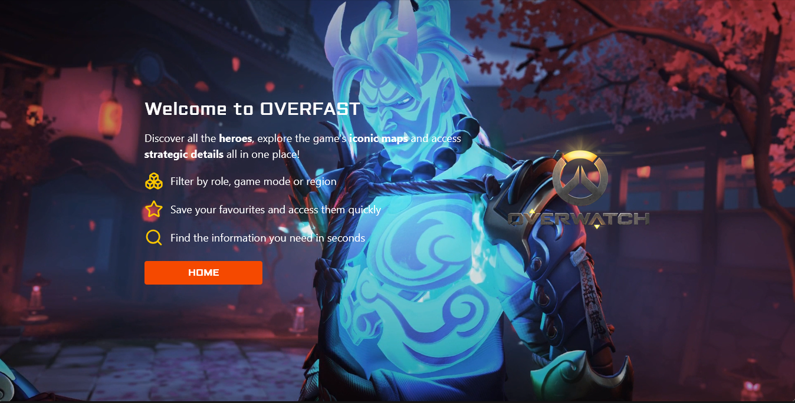
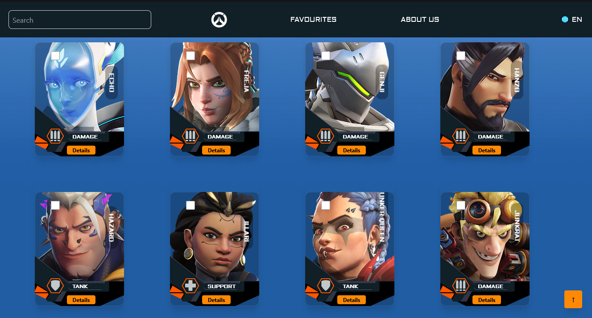
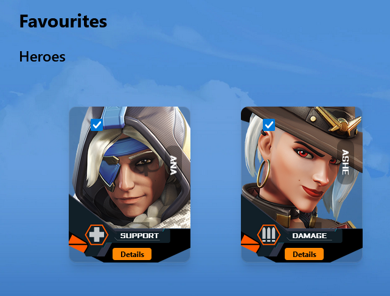
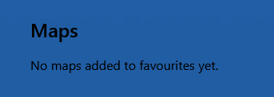

# PWA - TP2

```
                        .="=.
                      _/.-.-.\_     _
                     ( ( o o ) )    ))
                      |/  "  \|    //
      .-------.        \'---'/    //
     _|hello  |_       /`"""`\\  ((
   =(_|_______|_)=    / /_,_\ \\  \\
     |:::::::::|      \_\\_'__/ \  ))
     |:::::::[]|       /`  /`~\  |//
     |o=======.|      /   /    \  /
jgs  `"""""""""`  ,--`,--'\/\    /
                   '-- "--'  '--'

```
---


Este proyecto es una **Single Page App (SPA)** desarrollada en **React**, **Vite** y **TailwindCSS**. La app está diseñada para explorar información sobre héroes y mapas del juego Overwatch, permitiendo a los usuarios filtrar, buscar, y guardar sus favoritos.

## Página disponible en Vercel

- [Overwatch-TP2-API](https://overwatch-api-five.vercel.app/)

## Equipo de Trabajo:
- [Pacheco Leonardo](https://github.com/pachecoleoo)
- [Pilchuman Esteban](https://github.com/Esteban0010)
- [Villablanca Rodrigo](https://github.com/shodrig0)

## Contenido

- [Características](#características)
- [Estructura del Proyecto](#estructura-del-proyecto)
- [Instalación](#instalación)
- [Scripts](#scripts)
- [Uso](#uso)
- [Tecnologías](#tecnologias)
- [Aclaraciones importantes](#aclaraciones-importantes)
- [Screenshots](#screenshots)


## Características

- **Landing Page**: Página de bienvenida con un video como presentación.
- **Exploración de Héroes y Mapas**: Visualización de héroes y mapas con todos los detalles.
- **Favoritos**: Posibilidad de guardar héroes y mapas como favoritos.
- **Filtros y Ordenamiento**: Filtrar por roles y ordenar alfabéticamente.
- **Detalles**: Información detallada de héroes y mapas.
- **Errores Personalizados**: Páginas de error 404 y 422.


## Estructura del Proyecto

```plaintext
src/
├── Components/       # Componentes reutilizables
├── Const/            # Constantes del proyecto
├── Contexto/         # Contextos de React (e.g., paginación)
├── Hooks/            # Hooks personalizados
├── Pages/            # Páginas principales de la aplicación
├── assets/           # Recursos estáticos
├── [App.jsx](http://_vscodecontentref_/1)           # Componente principal
├── [main.jsx](http://_vscodecontentref_/2)          # Punto de entrada de la aplicación
public/               # Archivos públicos (imágenes, íconos, etc.)
```

## Instalación

1. Cloná este repositorio:
```
git clone https://github.com/tu-usuario/PWA-TP2.git
cd PWA-TP2
```

2. Instalá las dependencias:
```
npm i
```

3. Configura las variables de entorno: Crea un archivo .env en la raíz del proyecto y define la URL de la API de [Overfast](https://overfast-api.tekrop.fr):
```
VITE_API_URL=https://overfast-api.tekrop.fr (es una API Pública, no pasa nada)
```

## Scripts

En el archivo package.json se encuentran los scripts necesarios:
- ```npm run dev```: Inicia el servidor de desarrollo
- ```npm run build```: Genera una versión optimizada para producción
- ```npm run lint```: Ejecuta ESLint para analizar el código.


## Uso

1. Inicia el servidor de desarrollo con este comando:
```npm run dev```

2. En tu browser pegá este link:
```http://localhost:5173```


## Tecnologías

Principales

- **React**: Biblioteca para construir interfaces de usuario
- **React Router DOM**: Navegación entre páginas.
- **TailwindCSS**: Framework de estilos CSS.
- **Parallax.js**: Efectos de scroll.

Desarrollo

- **Vite**: Herramienta de construcción rápida.
- **ESLint**: Linter para mantener la calidad del código.


## Aclaraciones Importantes

1. Primero:

La API [OverFast](https://overfast-api.tekrop.fr) proporciona datos completos sobre héroes, modos de juego, mapas y estadísticas de jugadores de Overwatch 2 mediante el scraping de páginas de Blizzard. Desarrollada con la eficiencia de FastAPI y Selectolax, utiliza nginx (OpenResty) como proxy inverso y Redis para el almacenamiento en caché. Su mecanismo de almacenamiento en caché personalizado reduce significativamente las llamadas a páginas de Blizzard, garantizando una entrega de datos rápida y precisa a los usuarios.
Por lo tanto, considerar estas restricciones:

- **Límite de velocidad por IP**: 30 solicitudes/segundo (capacidad de ráfaga: 5)
- **Máximo de conexiones/solicitudes simultáneas por IP**: 10
- **Delay de reintento tras la limitación de velocidad de Blizzard**: 5 segundos

Así que paciencia con la carga al principio!

2. Hooks Personalizados:

Para separar la lógica de los componentes lo máximo posible, para no ensuciarlos tanto, optamos por usar Hooks Personalizados para estos casos:

---

```useHeroes.js```:

Este hook se encarga de manejar la lógica relacionada con los héroes del juego Overwatch.

- **Funcionalidad Principal**:
    - Realizar solicitudes a la API para obtener la lista de héroes
    - Filtrar héroes por roles (tanque, soporte, daño)
    - Gestionar el estado de carga y errores al obtener los datos

- **Ejemplo de uso en un componente**:

    - ```const { heroes, loading, error } = useHeroes()```

---
```useMaps.js```:

Este hook está diseñado para manejar la lógica relacionada con los mapas del juego.

- **Funcionalidad Principal**:
    - Obtener la lista de mapas desde la API
    - Filtrar mapas por tipo de juego o características específicas
    - Gestionar el estado de carga y errores

- **Ejemplo de uso**:

    - ```const { maps, loading, error } = useMaps()```

---

```usePageTitle.js```:

Sencillo. Es para gestionar dinámicamente el título de la página en el navegador.

- **Función Principal**:
    - Actualizar el título de la pestaña del navegador según la página actual
    - Restaurar el título predeterminado cuando se abandona una página

- **Ejemplo de uso en el Home**:

    - ```usePageTitle() // -> en la tab del browser renderizará 'Home'```

---

```useAboutUs.js```:

Es la API de GitHub para poder listar a este equipo de desarrollo de manera más dinámica

- Función Principal:
    - Matener actualizado a los integrantes del equipo con sus imgs, bios y posiblemente sus repositorios
    - Mostrar el link del perfil

- Ejemplo de uso en About Us Container:

```const user = useAboutUs()```

---

## Screenshots

Landing



Home


Botones de paginado


Favoritos de Heroes



Favoritos de Mapas


---

Eso es todo. Cualquier duda, pueden escribirnos al DM.

```
 __                 
'. \                       See you, bye bye!
 '- \               
  / /_         .---.
 / | \\,.\/--.//    )
 |  \//        )/  / 
  \  ' ^ ^    /    )____.----..  6
   '.____.    .___/            \._) 
      .\/.                      )
       '\                       /
       _/ \/    ).        )    (
      /#  .!    |        /\    /
      \  C// #  /'-----''/ #  / 
   .   'C/ |    |    |   |    |mrf  ,
   \), .. .'OOO-'. ..'OOO'OOO-'. ..\(,
   ```